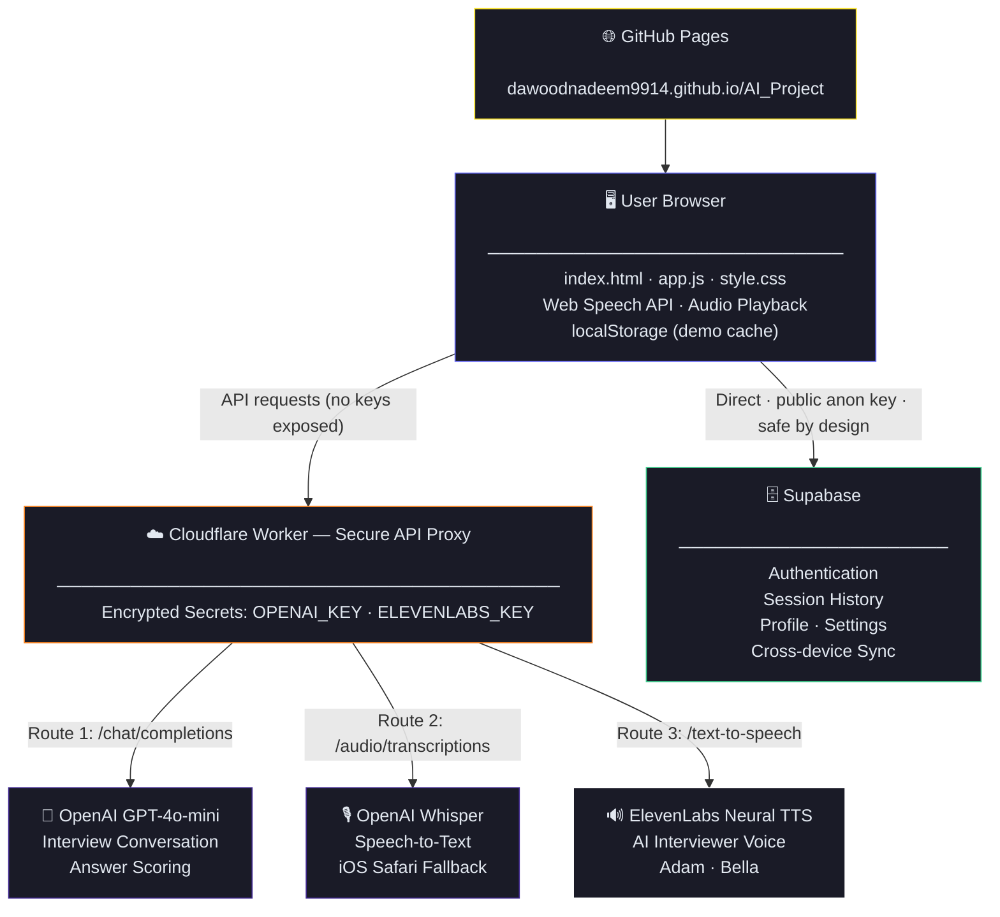

<div align="center">


# 🤖 AI Coach Interview
### *Intelligent interview preparation — powered by AI, free for everyone*

[](https://dawoodnadeem9914.github.io/AI_Project)
[](https://github.com/dawoodnadeem9914/AI_Project)
[](#)
[](#)
[](#)
[](#)
[](https://dawoodnadeem9914.github.io/AI_Project)
[](LICENSE)
[](#)

> **Practice smarter. Get hired faster.**  
> Your AI interviewer listens to your voice, tracks your progress, and gives you a detailed performance report after every session.

**[🌐 Launch the App](https://dawoodnadeem9914.github.io/AI_Project)** &nbsp;|&nbsp; Built for CCS3600 Artificial Intelligence &nbsp;|&nbsp; Universiti Putra Malaysia

</div>

---

## 📋 Table of Contents

- [Overview](#-overview)
- [Live Demo](#-live-demo)
- [Features](#-features)
- [Tech Stack](#-tech-stack)
- [System Architecture](#-system-architecture)
- [File Structure](#-file-structure)
- [How It Works](#-how-it-works)
- [Setup & Deployment](#-setup--deployment)
- [Browser Compatibility](#-browser-compatibility)
- [Project Team](#-project-team)

---

## 🌟 Overview

**AI Coach Interview** is a free web application that helps students and fresh graduates practice for job interviews. Instead of reading tips from a website or practising alone, users have a real conversation with an AI interviewer that:

- 🎙️ **Listens to your voice** using the Web Speech API (desktop/Android) or OpenAI Whisper (iOS)
- 🧠 **Asks intelligent follow-up questions** powered by GPT-4o-mini with full conversation memory
- 🔊 **Speaks back in a natural human voice** via ElevenLabs neural text-to-speech
- 📊 **Scores your performance** across Communication, Content Quality, Confidence, and Fluency
- 💾 **Syncs your history** across all devices via Supabase cloud authentication

The app runs **entirely in the browser** — no installation required, no backend server, completely free.

> Built for **CCS3600 Artificial Intelligence** — Universiti Putra Malaysia (UPM), Sem 2 2025/2026.

---

## 🌐 Live Demo

| | |
|---|---|
| **App URL** | [https://dawoodnadeem9914.github.io/AI_Project](https://dawoodnadeem9914.github.io/AI_Project) |
| **Best Browser** | Google Chrome or Microsoft Edge |
| **Mobile** | Android Chrome ✅ · iPhone Safari ✅ (Whisper fallback) |
| **Cost** | 100% Free — no account required to try |

---

## ✨ Features

### 🎙️ Voice-First Interview Experience
- **Live speech recognition** on Chrome, Edge, and Android via Web Speech API
- **iOS support** via OpenAI Whisper — records audio and transcribes after submission
- **Filler word detection** counts "um", "uh", "basically", "literally" in real-time while speaking
- **ElevenLabs AI voice** — choose between Adam (male, default) or Bella (female) interviewer
- **Auto-submit timer** — configurable silence detection: 2s, 3.5s (default), or 5s

### 🧠 AI Interview Engine (GPT-4o-mini)
- **Three-phase interview**: Warmup → Transition → Technical questions
- **Full context memory** — AI remembers the entire conversation, never repeats questions
- **5 Industries**: Technology · Banking & Finance · Healthcare · Education · Engineering
- **3 Experience Levels**: Internship · Fresh Graduate · Senior Position
- **Flexible sessions**: 1, 3, 5, or custom questions (up to 10 per session)

### 📊 Performance Report
- **Overall score** out of 100 with animated ring and grade (Excellent / Good / Fair / Needs Work)
- **4 category scores**: Communication · Content Quality · Confidence · Fluency
- **Fluency penalty**: each filler word deducts 4 points from Fluency score
- **STAR method evaluation**: Situation, Task, Action, Result scoring rubric
- **3 personalised improvement tips** tailored to your specific answers
- **Full answer breakdown**: per-question score, word count, filler count, AI feedback

### 📈 Progress Tracking (via Supabase)
- **Score Timeline chart** — your last 10 sessions visualised over time
- **Average Trend chart** — running average to track improvement
- **Session history cards** — filter by industry, score range, or keyword
- **Cross-device sync** — all data saved to Supabase, available anywhere you sign in

### ⚙️ Customisation
- Dark mode / Light mode with smooth transitions
- Normal / Large font size
- AI voice selection with live preview button
- AI speaking speed: Slow / Normal / Fast
- Profile photo, name, email, and password editable from settings

---

## 🛠️ Tech Stack

| Layer | Technology | Purpose |
|---|---|---|
| **Frontend** | HTML · CSS · JavaScript | All UI, interview logic, voice handling, charts |
| **AI — Conversation** | OpenAI GPT-4o-mini | Question generation, conversation, scoring |
| **AI — Voice Input (Desktop)** | Web Speech API | Live real-time speech-to-text |
| **AI — Voice Input (iOS)** | OpenAI Whisper | Audio transcription fallback for Safari iPhone |
| **AI — Voice Output** | ElevenLabs Neural TTS | Natural human interviewer voice |
| **Security Layer** | Cloudflare Workers | API proxy — hides keys from public source code |
| **Auth & Database** | Supabase | User accounts, session history, profile sync |
| **Hosting** | GitHub Pages | Free public deployment |

---

## 🏗️ System Architecture



---

## 📁 File Structure

```
AI_Project/
│
├── index.html   # ~910 lines  — All pages: login, dashboard, interview, results, settings
├── app.js       # ~2620 lines — All logic: AI calls, voice handling, charts, interview flow
├── style.css    # ~1800 lines — All styling: dark/light themes, responsive, animations
├── init.js      # ~5 lines   — API config for local dev (excluded from GitHub via .gitignore)
├── .gitignore   # Keeps init.js and API keys out of the public repository
└── README.md
```

---

## 🔄 How It Works

```
Step 1  User selects industry, experience level, and number of questions
        ↓
Step 2  App sends system prompt to GPT-4o-mini via Cloudflare Worker
        AI begins warmup phase — friendly intro questions to ease the user in
        ↓
Step 3  AI response text sent to ElevenLabs → Natural voice audio plays through speaker
        ↓
Step 4  Microphone activates:
        Desktop / Android  → Web Speech API transcribes live, words appear in real-time
        iPhone Safari      → MediaRecorder records audio → sent to Whisper after mic tap
        ↓
Step 5  Transcribed answer + full conversation history sent to GPT-4o-mini
        AI acknowledges the answer and asks the next question
        ↓
Step 6  Cycle repeats through Transition → Technical phases
        ↓
Step 7  All questions and answers sent to GPT-4o-mini with detailed scoring rubric
        Returns JSON: overall score, 4 category scores, strengths, weaknesses,
        3 improvement tips, per-answer feedback
        ↓
Step 8  Session metadata saved to Supabase
        Results shown: animated score ring, category bars, answer breakdown
```

**Scoring rubric evaluates:** Answer length · Content quality · Use of examples · STAR method · Filler word count

---

## 🚀 Setup & Deployment

### Prerequisites

| Tool | Purpose | Cost |
|---|---|---|
| GitHub Account | Host code + GitHub Pages deployment | Free |
| Cloudflare Account | Secure API proxy Worker | Free (100K req/day) |
| OpenAI API Key | GPT-4o-mini + Whisper | Pay per use |
| ElevenLabs API Key | Neural TTS voice | Free tier available |
| Supabase Project | Auth, user data, session history | Free tier |

### 1 — Set Up Cloudflare Worker

```
1. Go to Cloudflare Dashboard → Workers & Pages → Create new Worker
2. Paste the proxy code with 3 routes:
   /v1/chat/completions       → OpenAI (GPT-4o-mini + scoring)
   /v1/audio/transcriptions   → OpenAI Whisper (iOS voice input)
   /v1/text-to-speech/{id}    → ElevenLabs (AI voice output)
3. Settings → Variables → Add secrets:
   OPENAI_KEY     = your_openai_api_key
   ELEVENLABS_KEY = your_elevenlabs_api_key
4. Deploy → Copy the Worker URL
```

### 2 — Set Up Supabase

```
1. Create a Supabase project → Enable Email authentication
2. Authentication → URL Configuration:
   Site URL: https://your-username.github.io/AI_Project
   Redirect URLs: same URL (required for password reset)
3. Copy Project URL and Anon Key from API Settings → add to app.js
```

### 3 — Deploy to GitHub Pages

```bash
git clone https://github.com/dawoodnadeem9914/AI_Project.git
cd AI_Project

# Create init.js for local dev (DO NOT commit — it is in .gitignore)
# Add your Cloudflare Worker URL to this file for local testing

git push origin main

# Enable GitHub Pages:
# Repo Settings → Pages → Source: Deploy from main branch
# App goes live at: https://your-username.github.io/AI_Project
```

---

## 🌐 Browser Compatibility

| Browser | Voice Input | AI Voice | Notes |
|---|:---:|:---:|---|
| **Chrome (Desktop)** | ✅ Live transcript | ✅ ElevenLabs | **Best experience — recommended** |
| **Edge (Desktop)** | ✅ Live transcript | ✅ ElevenLabs | Fully supported |
| **Chrome (Android)** | ✅ Live transcript | ✅ ElevenLabs | Fully supported on mobile |
| **Safari (Mac)** | ✅ Live transcript | ✅ ElevenLabs | Needs one tap to unlock audio |
| **Safari (iPhone)** | ⚠️ Record → Whisper | ✅ ElevenLabs | No live text — transcribes after tap |
| **Firefox** | ❌ Not supported | ✅ ElevenLabs | Web Speech API unavailable |

> **iPhone note:** iOS Safari blocks microphone and audio until user interaction.
> The app shows a "Tap to enable voice" overlay on iPhone to handle this.

---

## 👥 Project Team

**CCS3600 Artificial Intelligence — Universiti Putra Malaysia (UPM)**
**Semester 2, 2025/2026**

| Name | Matric No. | Role |
|---|---|---|
| **Dawood Nadeem** | 226920 | Lead Developer |
| Fawzia Moradi | 226553 | Team Member |
| Nur Imanina Zafirah binti Kamaruzzaman | 228135 | Team Member |
| Nurul Izzah Binti Muhammad K.Y.Tiang | 228044 | Team Member |

**Supervisor:** Dr. Hazlina Binti Hamdan

---

## 📬 Contact

**Dawood Nadeem**  
BSc Computer Science @ University Putra Malaysia (UPM)  
📧 [Captaindawood12@gmail.com](mailto:Captaindawood12@gmail.com)  
🔗 [GitHub](https://github.com/dawoodnadeem9914)

---

<div align="center">

*⭐ Star this repo if it helped you — and go ace that interview!*


</div>
